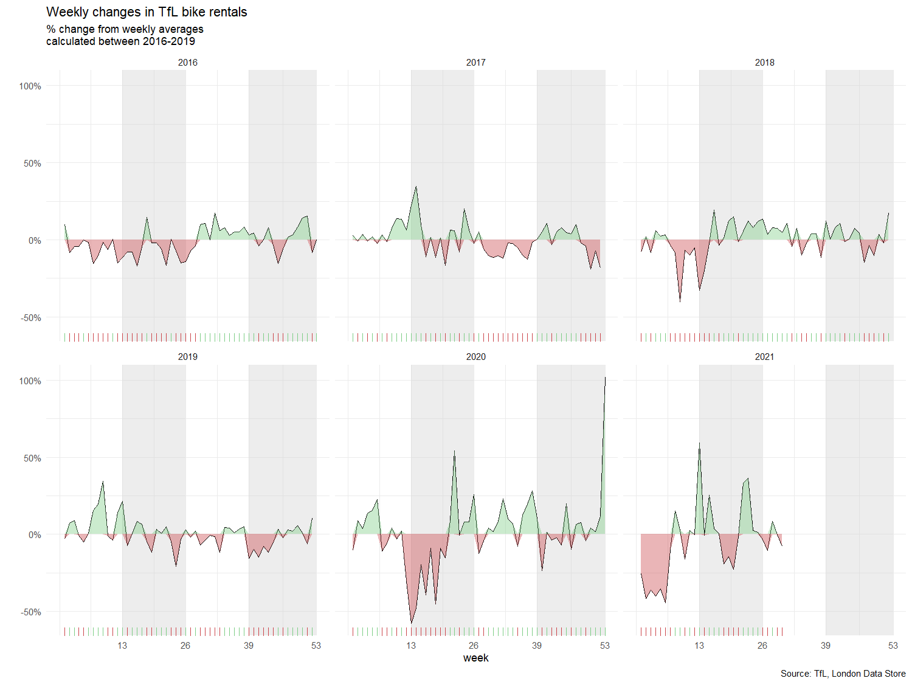

```{r, setup, include=FALSE}
knitr::opts_chunk$set(
  message = FALSE, 
  warning = FALSE, 
  tidy=FALSE,     # display code as typed
  size="small")   # slightly smaller font for code
options(digits = 3)

# default figure size
knitr::opts_chunk$set(
  fig.width=6.75, 
  fig.height=6.75,
  fig.align = "center"
)
```

```{r load-libraries, include=FALSE}
library(tidyverse)  # Load ggplot2, dplyr, and all the other tidyverse packages
library(mosaic)
library(ggthemes)
library(lubridate)
library(here)
library(skimr)
library(janitor)
library(httr)
library(readxl)
library(vroom)
library(wbstats)
library(countrycode)
library(patchwork)
library(gganimate)
library(infer)
library(lubridate)
library(knitr)
library(mosaic)
library(stats)
library(corrr)
library(gganimate)
library(gifski)
library(png)
```

# Climate change and temperature anomalies

```{r weather_data, cache=TRUE}

weather <- 
  read_csv("https://data.giss.nasa.gov/gistemp/tabledata_v4/NH.Ts+dSST.csv", 
           skip = 1, 
           na = "***")
```


## Select the year and the twelve month variables from the `weather` dataset and convert the dataframe from wide to 'long' format. 

```{r tidyweather}

#Converting into long format, first column (year) stays
weather_selected <- weather %>% 
  select(1:13)

tidyweather <- weather_selected %>% 
  pivot_longer(cols = 2:13,
               names_to = "month",
               values_to = "delta") 

tidyweather

```

## Let us plot the data using a time-series scatter plot, and add a trendline. 

```{r scatter_plot}

# Transforming the date
tidyweather <- tidyweather %>%
  mutate(date = ymd(paste(as.character(Year), month, "1")),
         month = month(date, label=TRUE))

# Creating scatterplot
ggplot(tidyweather, aes(x=date, y = delta))+
  geom_point(alpha = 0.4)+
  geom_smooth(color="red", se = FALSE) +
  theme_bw() +
  labs (
    title = "Weather Anomalies - Deviations (Base 1951-1980)",
    x = "Year",
    y = "Delta Temperature",
    caption = "Source: National Aeronautics and Space Administration - Goddard Institute (2022)"
  )

```


## Is the effect of increasing temperature more pronounced in some months?  

```{r facet_wrap, echo=FALSE}

# Facetting plot by month
ggplot(tidyweather, aes(x=date, y = delta))+
  geom_point(alpha = 0.4)+
  geom_smooth(color="red", se = FALSE) +
  facet_wrap(~month) +
  theme_bw() +
  labs (
    title = "Weather Anomalies - Deviations by Month (Base 1951-1980)",
    x = "Year",
    y = "Delta Temperature",
    caption = "Source: National Aeronautics and Space Administration - Goddard Institute (2022)"
  )

```

**Answer:**\

It looks like the colder months (Oct to April) have increased more significantly (steeper slope) than the summer months. This can also be confirmed by a report from the US Environmental Protection Agency which highlights that overally, minimum temperatures have increased at a higher rate than average maximum temperatures.


We remove data before 1800 and before using `filter`. Then, we use the `mutate` function to create a new variable `interval` which contains information on which period each observation belongs to. We can assign the different periods using `case_when()`.

```{r intervals}

# Code provided, creating new column for intervals with case_when function
comparison <- tidyweather %>% 
  filter(Year>= 1881) %>%     #remove years prior to 1881
  #create new variable 'interval', and assign values based on criteria below:
  mutate(interval = case_when(
    Year %in% c(1881:1920) ~ "1881-1920",
    Year %in% c(1921:1950) ~ "1921-1950",
    Year %in% c(1951:1980) ~ "1951-1980",
    Year %in% c(1981:2010) ~ "1981-2010",
    TRUE ~ "2011-present"
  ))


```


## Create a density plot to study the distribution of monthly deviations (`delta`), grouped by the different time periods we are interested in. 

```{r density_plot, fig.height=3}

# Different density courves in same figure
ggplot(comparison, aes(x = delta, fill = interval)) +
  geom_density(alpha = 0.5)+
  labs (
    title = "Weather Anomalies - Deviations by Period (Base 1951-1980)",
    x = "Delta Temperature",
    y = "Density",
    caption = "Source: National Aeronautics and Space Administration - Goddard Institute (2022)"
  ) +
  theme_bw()

```


## Create a scatter plot for average annual anomalies. 

```{r averaging}

#creating yearly averages
average_annual_anomaly <- tidyweather %>% 
  group_by(Year) %>%   #grouping data by Year
  
  # creating summaries for mean delta 
  # use `na.rm=TRUE` to eliminate NA (not available) values 
  summarise(meanDelta = mean(delta, na.rm=TRUE)) 

#plotting the data:

ggplot(average_annual_anomaly, aes(x = Year, y = meanDelta)) +
  geom_point()+
  #Fit the best fit line, using LOESS method
  geom_smooth(method="loess", colour="red", se = FALSE)+
  labs (
    title = "Weather Anomalies - Deviations annual mean (Base 1951-1980)",
    x = "Year",
    y = "Delta Temperature",
    caption = "Source: National Aeronautics and Space Administration - Goddard Institute (2022)"
  ) +
  #change theme to theme_bw() to have white background + black frame around plot
  theme_bw()

```

## Confidence Interval for `delta`

```{r calculate_CI_using_formula}

# Using formula approach for CI
formula_ci <- comparison %>% 
  # choose the interval 2011-present
  filter(interval == "2011-present") %>% 
  group_by(interval) %>% 
  
  # calculate summary statistics for temperature deviation (delta) 
  # calculate mean, SD, count, SE, lower/upper 95% CI
  summarize(mean = mean(delta, na.rm=TRUE),
            sd = sd(delta, na.rm=TRUE),
            count = n(),
            t_critical = qt(0.975, count-1),
            se_delta = sd/sqrt(count),
            margin_of_error = t_critical * se_delta,
            delta_low = mean - margin_of_error,
            delta_high = mean + margin_of_error)
#print out CI
kable(formula_ci,
      caption = "CI by Formula")

```


```{r bootstrap}

# Using bootstrap (infer package) approach for CI
set.seed(1234)

boot_delta <- comparison %>% 
  filter(interval == "2011-present") %>% 
  specify(response = delta) %>% 
  generate(reps = 1000, type = "bootstrap") %>%
  calculate(stat="mean")

bootstrap_ci <- boot_delta %>% 
  get_confidence_interval(level =0.95, type = "percentile")

#print out CI
kable(bootstrap_ci,
      caption = "CI by Bootstrapping")
```


**Answer:**\

We started by calculating the lower and upper boundary with the formula. This is done by using the t-distribution available in R (qt) and multiplying it with the standard error. The bootstrap simulation on the other hand creates 1000 repetitions out of the given data (delta in this case) and uses the get_confidence_interval function from the infer package to create the delta_low and delta_high value. First of all it can be said that with 1000 iterations, the bootstrap simulation yields the exact same results as the formula. Further the count (144) allows to have a low t_critical as well as a small standard error, producing a quite narrow confidence interval. 


# Biden's Approval Margins


```{r, cache=TRUE}
# Import approval polls data directly off fivethirtyeight website
approval_polllist <- read_csv('https://projects.fivethirtyeight.com/biden-approval-data/approval_polllist.csv') 

```

## Lubridate the chr dates

```{r lubridate}
# Use `lubridate` to fix dates, as they are given as characters.

approval_date <- approval_polllist %>% 
  mutate(enddate = mdy(enddate))

```


## Create a plot for net approval rating for each week in 2022

Your plot should look something like this:

```{r biden_margins, echo=FALSE, out.width="100%"}
knitr::include_graphics(here::here("images", "biden_approval_margin.png"), error = FALSE)
```


```{r biden, out.width="100%", fig.height=5}

# Filtering data for year and interested columns
poll_filtered <- approval_date %>% 
  select(c("enddate","subgroup","approve","disapprove")) %>% 
  filter(enddate >= "2022-01-01") %>% 
  mutate(week = week(enddate),
         dif = approve-disapprove)

# Calculating ci for each subgroup and week
ci_biden_facet <- poll_filtered %>% 
  group_by(week, subgroup) %>% 
  summarize(mean = mean(dif, na.rm=TRUE),
            sd = sd(dif, na.rm=TRUE),
            count = n(),
            t_critical = qt(0.975, count-1),
            se_diff = sd/sqrt(count),
            margin_of_error = t_critical * se_diff,
            diff_low = mean - margin_of_error,
            diff_high = mean + margin_of_error)

# Plotting line chart with ribbon function for CI
ggplot(ci_biden_facet, aes(x = week, y = mean, color = subgroup)) +
  geom_line() +
  geom_ribbon(aes(x=week, y=mean, ymax=diff_high, ymin=diff_low, color = subgroup), linetype=1, size = 0.7, fill = "brown", alpha=0.1)+
  facet_wrap(~subgroup, ncol = 1, strip.position="right") +
  labs(
    title = "Biden's net Approval Ratings in 2022",
    subtitle = "weekly data, approval - disapproval, %",
    y = NULL, 
    x = "Week in 2022",
    caption = "Source: https://projects.fivethirtyeight.com/Biden-approval-data/"
  ) +
  theme_bw() +
  theme(legend.position="none")

```

# Challenge 1: Excess rentals in TfL bike sharing

```{r get_tfl_data, cache=TRUE, include=FALSE}
url <- "https://data.london.gov.uk/download/number-bicycle-hires/ac29363e-e0cb-47cc-a97a-e216d900a6b0/tfl-daily-cycle-hires.xlsx"

# Download TFL data to temporary file
httr::GET(url, write_disk(bike.temp <- tempfile(fileext = ".xlsx")))

# Use read_excel to read it as dataframe
bike0 <- read_excel(bike.temp,
                   sheet = "Data",
                   range = cell_cols("A:B"))

# change dates to get year, month, and week
bike <- bike0 %>% 
  clean_names() %>% 
  rename (bikes_hired = number_of_bicycle_hires) %>% 
  mutate (year = year(day),
          month = lubridate::month(day, label = TRUE),
          week = isoweek(day))
```

## The challenge I want you to work on is to reproduce the following graph:


```{r tfl_absolute_monthly_change_self, out.width="100%", fig.height=4.5}

# generate expected bike hired value for each month
bike_expected_month<-bike %>% 
  filter(year>= 2016 & year <= 2019) %>% 
  group_by(month) %>% 
  mutate(expected_month_year=mean(bikes_hired, na.rm = TRUE)) %>%
  summarise(expected_mean=mean(expected_month_year)) 

# generate real bike hired value for each month in each year
bike_real_month<-bike %>% 
  filter(year>=2017 & year<=2022) %>% 
  group_by(year,month) %>% 
  summarise(actual_hired=mean(bikes_hired))

# combine expected and real bike table
combine = left_join(x=bike_expected_month, y=bike_real_month, by = "month", all.x=TRUE) %>% 
   mutate(min_1=pmin(actual_hired,expected_mean)) %>%
   group_by(year)

# graphing ribbon and line
h <- ggplot(combine, aes(x=month))
h+  geom_ribbon(aes(ymin=min_1, ymax=actual_hired ,group=year),fill="chartreuse4",alpha=0.25)+
    geom_ribbon(aes(ymin=min_1, ymax=expected_mean,group=year),fill="red", alpha=0.25)+
    geom_line(aes(y=expected_mean,group=year), color="blue",size=0.8)+
    geom_line(aes(y=actual_hired,group=year),color="black",size=0.2)+
    facet_wrap(~year)+
    labs(
    title = "Monthly changes in TfL bike rentals",
    subtitle = "Change from monthly average shown in blue
and caculated between 2016-2019",
    x = NULL,
    y = "Bike rentals",
    caption="Source: TfL, London Data Store")+
    scale_y_continuous(limits = c(10000,45000))+           
    theme_minimal()+
    theme(text = element_text(size = 7))

```


## The second one looks at percentage changes from the expected level of weekly rentals.



```{r tfl_percent_change_self, out.width="100%", fig.height=4.5}

# generate expected bike hired value for each week
bike_expected_week<-bike %>% 
  filter(year>=2016 & year<=2019) %>% 
  group_by(week) %>% 
  mutate(expected_week_year=mean(bikes_hired)) %>%
  summarise(expected_mean=mean(expected_week_year)) 

# generate real bike hired value for each month in each week
bike_real_week<-bike %>% 
  filter(year>=2017 & year <=2022) %>% 
  group_by(year,week) %>% 
  summarise(actual_hired=mean(bikes_hired))

# combine expected and real bike table  
combine1 = left_join(x=bike_expected_week, y=bike_real_week, by = "week", all.x=TRUE) %>% 
   mutate(change = (actual_hired - expected_mean)/expected_mean, rug_positive=ifelse(change>0, "col1", "col2")) %>%
   group_by(year) %>%                            
   filter(week < 52)                       # to limited the extreme value(the week 52/53 may cover next year)


# graphing ribbon and rug and line and rect
library(scales)     # library for percentage drawing
options(ggplot2.discrete.colour= c("chartreuse4", "red"))     # set the option for default factor color assignment 
h <- ggplot(combine1, aes(x=week), options)
h+geom_ribbon(aes(ymin=pmin(change,0), ymax=0 ,group=year),fill = "red", alpha = 0.25)+
    geom_ribbon(aes(ymin=0, ymax=pmax(change,0),group=year),fill = "chartreuse4", alpha = 0.25)+
    geom_line(aes(y=change,group=year), size = 0.7)+
    geom_rect(aes(xmin=14,xmax=26),fill="grey", ymin=-1,ymax=1.5, alpha=0.01)+
    geom_rect(aes(xmin=40,xmax=52),fill="grey", ymin=-1,ymax=1.5, alpha=0.01)+
    geom_rug(aes(color = rug_positive), show.legend = FALSE)+
    scale_y_continuous(limits = c(-0.55, 1.05),labels = percent)+         
    facet_wrap(~year)+
    labs(
    title = "Weekly changes in TfL bike rentals",
    subtitle = "% change from weekly averages
calculated between 2016-2019",
    x = "week",
    y = NULL,
    caption="Source: TfL, London Data Store"
  ) +
    theme_minimal()+
    theme(text = element_text(size = 7))

```

Should you use the mean or the median to calculate your expected rentals? Why?

**Answer:**\

Normally, a mean is used as expected values and in this case, expected rentals. This applies to the cases where the distribution is not extremely unsymmetrical. From the diagrams above, we can see that the distributions are generally symmetrical. If there are cases where the distributions are extremely skewed and have clear outliers, median would be preferred as the value is less distorted.***


# Challenge 2: Share of renewable energy production in the world

```{r load_technology_data, include=FALSE}

technology <- readr::read_csv('https://raw.githubusercontent.com/rfordatascience/tidytuesday/master/data/2022/2022-07-19/technology.csv')

#get all technologies
labels <- technology %>% 
  distinct(variable, label)

# Get country names using 'countrycode' package
technology <- technology %>% 
  filter(iso3c != "XCD") %>% 
  mutate(iso3c = recode(iso3c, "ROM" = "ROU"),
         country = countrycode(iso3c, origin = "iso3c", destination = "country.name"),
         country = case_when(
           iso3c == "ANT" ~ "Netherlands Antilles",
           iso3c == "CSK" ~ "Czechoslovakia",
           iso3c == "XKX" ~ "Kosovo",
           TRUE           ~ country))

#make smaller dataframe on energy
energy <- technology %>% 
  filter(category == "Energy")

# download CO2 per capita from World Bank using {wbstats} package
# https://data.worldbank.org/indicator/EN.ATM.CO2E.PC
co2_percap <- wb_data(country = "countries_only", 
                      indicator = "EN.ATM.CO2E.PC", 
                      start_date = 1970, 
                      end_date = 2022,
                      return_wide=FALSE) %>% 
  filter(!is.na(value)) %>% 
  #drop unwanted variables
  select(-c(unit, obs_status, footnote, last_updated))

# get a list of countries and their characteristics
# we just want to get the region a country is in and its income level
countries <-  wb_cachelist$countries %>% 
  select(iso3c,region,income_level)

```


## First, produce a graph with the countries with the highest and lowest % contribution of renewables in energy production. 


 
```{r min-max_renewables, echo=FALSE, out.width="100%", fig.height=4}
knitr::include_graphics(here::here("images", "renewables.png"), error = FALSE)
```

```{r min-max_renewables-self, out.width="100%", fig.height=4.5}

#Energy Dataset converted to wide format and calculated % of renewable energy (rounded 3 decimal places)
energy_renew <- energy %>% 
  filter(year==2019)  %>% 
  select(c(variable,value,country)) %>%
  pivot_wider(names_from = variable, values_from = value) %>% 
  mutate(perc_hydro=round(elec_hydro/elecprod, 3),
         perc_solar=round(elec_solar/elecprod, 3),
         perc_wind=round(elec_wind/elecprod, 3),
         perc_renew_other=round(elec_renew_other/elecprod, 3),
         perc_renew=round(perc_hydro+perc_solar+perc_wind+perc_renew_other,3)) %>% 
  mutate(country=fct_reorder(country,perc_renew))

#Filtered data set for non-negative percentage and chose the bottom 20 countries followed by the graph formatting
energy_min_20 <- energy_renew %>% 
  filter(perc_renew>0) %>% 
  group_by(country) %>% 
  summarise(perc_renew=sum(perc_renew)) %>% 
  slice_min(perc_renew,n=20) %>% 
  mutate(country=fct_reorder(country,perc_renew)) %>% 
  ggplot(aes(perc_renew,country))+
  geom_col()+
  scale_x_continuous(labels=scales::percent)+
  labs(x=NULL,y=NULL)+
  theme_minimal() +
  theme(text = element_text(size = 7))

#Filtered data set for non-negative percentage and chose the top 20 countries followed by the graph formatting  
energy_max_20 <- energy_renew %>% 
  filter(perc_renew>0) %>% 
  group_by(country) %>% 
  summarise(perc_renew=sum(perc_renew)) %>% 
  slice_max(perc_renew,n=20) %>% 
  mutate(country=fct_reorder(country,perc_renew)) %>% 
  ggplot(aes(perc_renew,country))+
  geom_col()+
  scale_x_continuous(labels=scales::percent)+
  labs(x=NULL,y=NULL)+
  theme_minimal()+
  theme(text = element_text(size = 7))

#Graphs are combined and labelled
energy_max_20 + energy_min_20 +
  plot_annotation(title = "Highest and lowest % of renewables in energy production",
                  subtitle = "2019 Data",
                  caption = "Source: NBER CHAT Database")
```


## Second, you can produce an animation to explore the relationship between CO2 per capita emissions and the deployment of renewables. As the % of energy generated by renewables goes up, do CO2 per capita emissions seem to go down?
 

```{r animation, echo=FALSE, out.width="100%"}
knitr::include_graphics(here::here("images", "animation.gif"), error = FALSE)
```

```{r animation-self, out.width="100%"}

#Create a pivot wider format and add new column
energy_perc <- energy %>% 
  select(year, variable,value,country) %>% 
  pivot_wider(names_from = variable, values_from = value) %>% 
  mutate(percent_renew = (elec_hydro+elec_solar+elec_wind+elec_renew_other)/elecprod *100) 

# Select only interested columns in energy chart
energy_perc_filtered <- energy_perc %>% 
  select(year, country, percent_renew)
  
# Select only interested columns in co2 chart
co2_percap_filtered <- co2_percap %>% 
  select(country, date, value, iso3c) %>% 
  rename(year = date)

# Join the tables (energy, co2, and income_level)
energy_combined1 <- left_join(energy_perc_filtered, co2_percap_filtered, by = c("country", "year"))
energy_combined2 <- left_join(energy_combined1, countries, by = c("iso3c"))

# Create visualization (packages required)
energy_combined2 %>% 
  mutate(year = as.integer(year)) %>% 
  filter(year>=1990, !is.na(income_level)) %>% 
  ggplot(aes(x=percent_renew, y=value, color = income_level))+
  geom_point()+
  theme_bw()+
  theme(legend.position="none")+
  facet_wrap(~income_level) +
  labs(title = 'Year: {frame_time}', 
       x = '% renewables', 
       y = 'CO2 per cap') +
  transition_time(year) +
  ease_aes('linear')

#Find out correlation    
kable(correlate(energy_combined2$percent_renew,energy_combined2$value), 
      caption = "Correlation CO2 and renewables")

```

**Answer:**\

Since the correlation value for Co2 emission and usage renawable energy is negative, we can roughly say that as usage of renewable energy goes up, we can reduce CO2 emission by up to 33%. This finding would correspond to the common understanding on how renewable energy could be a vital factor in slowing down climate change.\


# Deliverables

As usual, there is a lot of explanatory text, comments, etc. You do not
need these, so delete them and produce a stand-alone document that you
could share with someone. Knit the edited and completed R Markdown file
as an HTML document (use the "Knit" button at the top of the script
editor window) and upload it to Canvas.

# Details

-   Who did you collaborate with: *Vani Duggal, Mehak Khanna, Manon Pillot, Nick Chen, Liyang Zhang, Tobias Delago*
-   Approximately how much time did you spend on this problem set: *20h*
-   What, if anything, gave you the most trouble: *eliminating conceptual errors, getting the exact same order in challenge 2 due to rounding issues*

**Please seek out help when you need it,** and remember the [15-minute
rule](https://mam202.netlify.app/syllabus/#the-15-minute-rule){target="_blank"}.
You know enough R (and have enough examples of code from class and your
readings) to be able to do this. If you get stuck, ask for help from
others, post a question on Slack-- and remember that I am here to help
too!

> As a true test to yourself, do you understand the code you submitted
> and are you able to explain it to someone else?

# Rubric

Check minus (1/5): Displays minimal effort. Doesn't complete all
components. Code is poorly written and not documented. Uses the same
type of plot for each graph, or doesn't use plots appropriate for the
variables being analyzed.

Check (3/5): Solid effort. Hits all the elements. No clear mistakes.
Easy to follow (both the code and the output).

Check plus (5/5): Finished all components of the assignment correctly
and addressed both challenges. Code is well-documented (both
self-documented and with additional comments as necessary). Used
tidyverse, instead of base R. Graphs and tables are properly labelled.
Analysis is clear and easy to follow, either because graphs are labeled
clearly or you've written additional text to describe how you interpret
the output.
